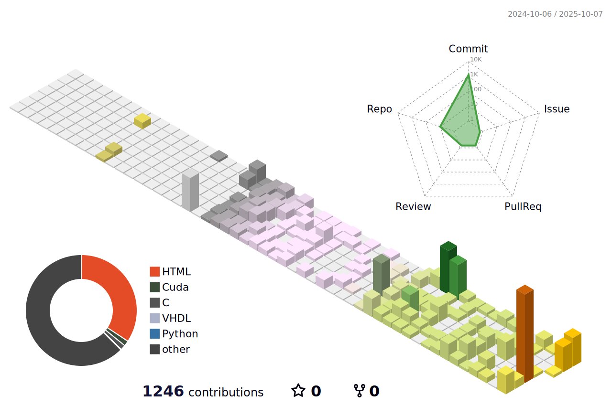

## 📕 博客动态
<!-- BLOG-POST-LIST:START -->
- [高斯泼溅](https://hatrix.site/posts/%E9%AB%98%E6%96%AF%E6%B3%BC%E6%BA%85/)
- [编码与开发](https://hatrix.site/posts/%E7%BC%96%E7%A0%81%E4%B8%8E%E5%BC%80%E5%8F%91/)
- [数学工具](https://hatrix.site/posts/%E6%95%B0%E5%AD%A6%E5%B7%A5%E5%85%B7/)
- [博客杂货铺](https://hatrix.site/posts/%E5%8D%9A%E5%AE%A2%E6%9D%82%E8%B4%A7%E9%93%BA/)
- [工具箱](https://hatrix.site/posts/%E5%B7%A5%E5%85%B7%E7%AE%B1/)
<!-- BLOG-POST-LIST:END -->

<picture>
  <source media="(prefers-color-scheme: dark)" srcset="https://raw.githubusercontent.com/SparkyXXX/SparkyXXX/output/github-contribution-grid-snake-dark.svg">
  <source media="(prefers-color-scheme: light)" srcset="https://raw.githubusercontent.com/SparkyXXX/SparkyXXX/output/github-contribution-grid-snake.svg">
  
</picture>
