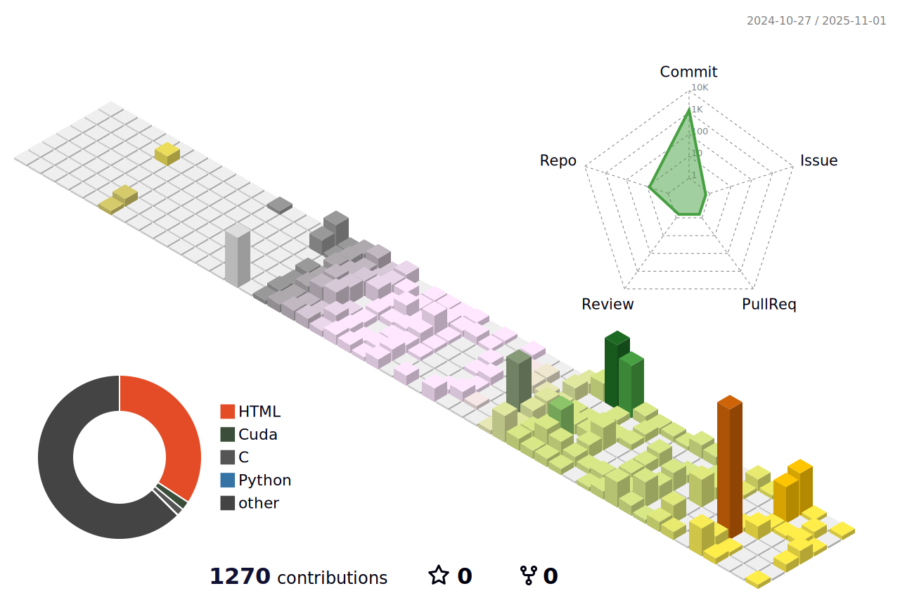

## 📕 博客动态
<!-- BLOG-POST-LIST:START -->
- [Vivado 开发实践](https://hatrix.site/posts/Vivado%E5%BC%80%E5%8F%91%E5%AE%9E%E8%B7%B5/)
- [嵌入式系统](https://hatrix.site/posts/%E5%B5%8C%E5%85%A5%E5%BC%8F%E7%B3%BB%E7%BB%9F/)
- [FPGA 硬件架构](https://hatrix.site/posts/FPGA%E7%A1%AC%E4%BB%B6%E6%9E%B6%E6%9E%84/)
- [数字电子技术](https://hatrix.site/posts/%E6%95%B0%E5%AD%97%E7%94%B5%E5%AD%90%E6%8A%80%E6%9C%AF/)
- [Verilog 语法](https://hatrix.site/posts/Verilog%E8%AF%AD%E6%B3%95/)
<!-- BLOG-POST-LIST:END -->

<picture>
  <source media="(prefers-color-scheme: dark)" srcset="https://raw.githubusercontent.com/SparkyXXX/SparkyXXX/output/github-contribution-grid-snake-dark.svg">
  <source media="(prefers-color-scheme: light)" srcset="https://raw.githubusercontent.com/SparkyXXX/SparkyXXX/output/github-contribution-grid-snake.svg">
  
</picture>
